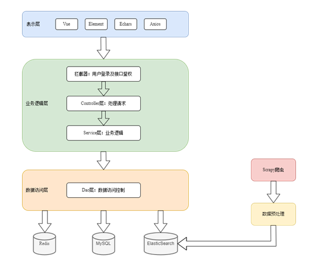
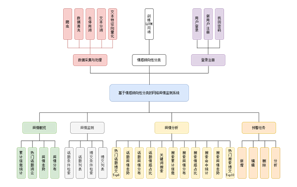
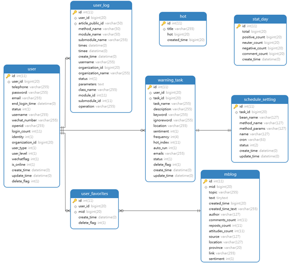

# public_opinion_monitor

### 介绍

本网络舆情监测系统基于LSTM-CNN模型实现情感倾向性分类，旨在帮助用户监测和分析微博平台上的舆情，以了解公众对某个话题或事件的情感倾向。系统的输入是微博平台上热搜话题和用户发布的微博数据，系统使用预训练的LSTM-CNN模型来自动分析正文中的情感倾向性，可以对文本进行正面、负面和中性情感的分类。系统还允许用户以多种方式分析舆情，包括话题分析、搜索分析、预警任务分析等，并提供实时预警功能，以邮件的形式提醒用户。系统的用户界面友好易用，可视化程度高，可以让用户轻松地监测和分析舆情，并及时了解公众对某个话题或事件的情感倾向，在测试集上的测试结果表明，本系统的情感倾向性分类准确率达到88.25%。

v1.0.0 毕设项目：微博舆情监测系统后端项目

前端项目：https://gitee.com/NoBug_XXH/public_opinion_monitor_ui

爬虫项目：https://gitee.com/NoBug_XXH/weibo_spyder

情感倾向性分类模型：待开源

如果觉得项目还不错，请给个star或者fork吧！！

### 技术栈

- SpringBoot
- Mybatis-Plus
- MySQL
- ElasticSearch
- Redis
- JWT：用户登录及接口鉴权
- ThreadPoolTaskExecutor：动态添加定时预警任务

### 计划

1. 预计三月底开源情感倾向性分类模型
2. 预计三月底上线体验版
3. 目前为单体项目，预计四月份完成：拆分微服务，使用Spring Cloud Alibaba

### 项目结构

- common：公共类，如GlobalException、统一的响应格式R等
- config：存放配置类
- controller：Controller层
- dao：Dao层
- dto：存放数据转换对象
- entity：存放实体类
- interceptor：存放拦截器
- schedule：存放定时任务相关类
- service：Servcie层
  - impl：Service实现类
- utils：公共工具类
  - constant：定义常量

### 系统总体架构

系统的总体架构为三层架构，结合本系统的实际需求，选择多个数据库存储，同时增加Scrapy爬虫及数据预处理模块，实现对微博舆情的实时监测。

1. 表示层：负责展示数据和与用户交互。本系统中使用了Vue+Element实现用户界面、Echars展示图表、Axios发起请求访问后端数据。
2. 业务逻辑层：负责处理业务逻辑，例如计算、验证和规则执行等。它可以协调数据访问层的操作，来满足业务需求。在本系统中，首先需要进行用户登录及接口鉴权，除了注册登录相关的接口外，其它接口都需要校验请求中携带的JWT。接着通过请求URL映射，匹配对应的Controller处理器，调用相关的Service层服务实现业务逻辑。
3. 数据访问层：负责与数据存储系统进行交互，例如数据库、文件等。通常包含一些数据访问对象（DAO）和数据持久化层。

### 系统功能架构

本系统的功能架构设计包括七个模块：

1. 数据采集与处理：

   该模块主要负责从微博平台上采集数据，包括热搜话题、微博正文、评论数、点赞数、转发数等等，接着对正文文本进行数据清洗、去停用词、文本分词、文本特征向量化处理，再由情感倾向性分类器生成标签，最后批量存储进ElasticSearch。

2. 情感倾向性分类：

   该模块主要负责训练LSTM网络，训练数据集使用开源的10000条带有情感标签的微博正文数据集，测试数据集大小为500，对网络进行训练和优化。

3. 登录注册：

   该模块主要负责用户登录和注册功能，并作了安全性处理。用户注册时，需要填写注册表单，包括手机号码、邮箱、密码等等，前端对手机号码进行格式校验，并使用AES对称加密技术对密码进行加密，发送注册请求给后端。后端AES对称解密，对密码进行MD5加密，将用户信息存储数据库。用户登录时，后端同理生成一个密码的MD5值，与数据库中存储的密码MD5值进行对比即可。该模块还具有通过验证码找回密码的功能。

4. 舆情概览：

   该模块主要可视化展示微博舆情的总体信息，主要包括累计信息统计：累计微博话题数、累计微博博文数、累计负面舆论数和累计用户评论数，热门话题词云图、舆情走势图、舆情分布图。

5. 舆情监测：

   该模块主要是以列表的形式展示微博话题信息和博文信息，并支持根据条件检索，针对话题进行分析，打开微博原文等功能。

6. 舆情分析：

   该功能主要包括话题分析和搜索分析。话题分析中，可视化展示该话题下热度Top6的微博博文信息、舆情走势、舆情分布及舆情情感占比；搜索分析中，支持用户输入关键词检索，系统自动对搜素词分词，可视化展示搜索结果分析，主要包括累计信息统计：全部舆情数、正面舆情数、中性舆情数和负面舆情数，搜索结果信息的舆情分布、情感占比、关键词命中数、舆情走势图和全部/正面/中性/负面舆论Top10列表。

7. 预警任务：

   该功能主要包括新增、编辑、删除、分析预警任务。用户可以设置任务名称、任务描述、关键词、屏蔽词、位置、情感倾向、预警频次、预警门槛、预警邮箱、是否自动运行等属性，针对每个任务分析，跳转任务分析页面。

### 数据库设计

#### MySQL

本系统的数据库总体关系图如下图所示。一共包含八个表，分别为用户表、用户日志表、用户收藏表、话题表、微博博文表、预警任务表、定时任务配置表、每日统计表。其中，各个表中的id字段为物理id，使用MySQL中的自增主键策略，顺序插入，提高查询、插入等操作的执行效率。其中用户表user与用户日志表user_log、预警任务表warning_task、用户收藏表user_favorites为一对多的关系，用户表的逻辑主键user_id在用户日志表、预警任务表、用户收藏表中作为外键；微博博文表mblog与用户收藏表user_favorites为一对多的关系，微博博文表的逻辑主键mid在用户收藏表中作为外键；预警任务表warning_task与定时任务配置表schedule_setting为一对一的关系，预警任务表的task_id在定时任务配置表中作为外键。

需要说明的是，根据**阿里巴巴JAVA规范，不得使用外键与级联，一切外键概念必须在应用层解决**。外键的使用会加重数据库的压力，对表进行增删操作均会带来额外的数据一致性校验查询，因此本系统的外键约束均在业务层实现。

**索引设计：待补充**

#### ElasticSearch

- 热搜话题索引库：

  | 属性名       | 类型    | 是否分词 | 分词策略    | 说明     |
  | ------------ | ------- | -------- | ----------- | -------- |
  | title        | Text    | 是       | ik_max_word | 热搜标题 |
  | hot          | Integer |          |             | 热度     |
  | created_time | Long    |          |             | 入库时间 |

- 微博博文索引库：

  | 属性名            | 类型    | 是否分词 | 分词策略    | 说明       |
  | ----------------- | ------- | -------- | ----------- | ---------- |
  | mid               | Keyword |          |             | 博文id     |
  | topic             | Keyword |          |             | 话题       |
  | text              | Text    | 是       | ik_max_word | 正文       |
  | created_time      | Long    |          |             | 入库时间   |
  | created_time_text | Keyword |          |             | 时间字符串 |
  | author            | Keyword |          |             | 作者       |
  | comments_count    | Integer |          |             | 评论数     |
  | reposts_count     | Integer |          |             | 转发数     |
  | attitudes_count   | Integer |          |             | 点赞数     |
  | source            | Keyword |          |             | 发布源     |
  | location          | Text    | 是       | ik_max_word | 发布位置   |
  | province          | Keyword |          |             | 省份       |
  | link              | Keyword |          |             | 链接       |
  | sentiment         | Integer |          |             | 情感倾向   |

### 参与贡献

1.  Fork 本仓库
2.  新建 Feat_xxx 分支
3.  提交代码
4.  新建 Pull Request

